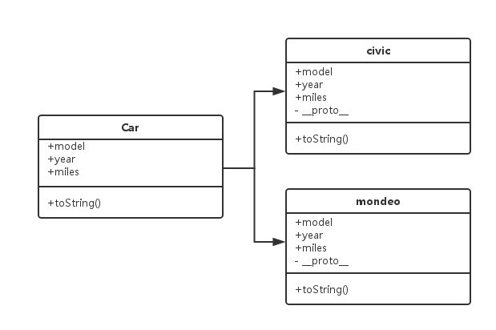

## 构造器（Constructor）模式   

### 基本构造器
> 对象构造器用于创建特定类型的对象——准备好对象以备使用，同时接收构造器可以使用的参数，以在第一次创建对象时，设置成员属性和方法的值。概念并没什么好说的，这种模式最是简单，虽然名字是那么吊炸天，但内容没什么，看下面例子就可明白。   


```
function Car( model, year, miles ) {
  this.model = model;
  this.year = year;
  this.miles = miles;
  this.toString = function () {
    return this.model + " has done " + this.miles + " miles";
  };
}
// Usage:
// We can create new instances of the car
var civic = new Car( "Honda Civic", 2009, 20000 );
var mondeo = new Car( "Ford Mondeo", 2010, 5000 );
// and then open our browser console to view the
// output of the toString() method being called on
// these objects
console.log( civic.toString() );
console.log( mondeo.toString() );
```    

    

### 带原型的构造器   

```
function Car(model, year, miles) {
    this.model = model;
    this.year = year;
    this.miles = miles;

    Car.prototype.toString = function() {
        return this.model + " has done " + this.miles + " miles";
    }
}

var civic = new Car( "Honda Civic", 2009, 20000 );
var mondeo = new Car( "Ford Mondeo", 2010, 5000 );
console.log( civic.toString() );
console.log( mondeo.toString() );

```   

    

### 两者区别   

> 这两个示例区别就在于toString方法的定义。前一个例子每一个实例都各自重新定义这种方法；后一个例子使用原型定义方式，使得这种方法在所有的Car实例之间共享，好处在于，共享函数能够减少内存消耗（我认为），优化代码。

> 这里需要注意几件事：

1. 函数才有prototype属性，指向的是一个实例对象（不是函数）。

2. 每个实例对象都有__proto__的属性，这个属性指向原函数所指的原型对象（原型继承的基础）。